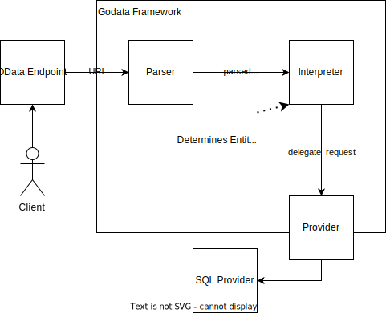

# Godata

Builds upon previous works in https://github.com/crestonbunch/godata.

# Architecture

Rough idea:

# Implementation Progress

## Legend
- ☑ Implemented
- ☐ Planned, but not yet implemented. This does not indicate any date or time of when it will be implemented
- ☒ Not planned at the moment. May change at any time as priorities shift

## General Framework Features
- ☐ OData Grammar Parser Component
- ☐ Middleware Pipeline Support such as authentication layers
- ☐ Data Provider Interface
  - ☐ Out of the box postgres SQL provider 

## OData 4.0.1 Protocol

This section is based on the [OData v4 Protocol documentation](https://docs.oasis-open.org/odata/odata/v4.01/odata-v4.01-part1-protocol.html).
As such some points may overlap.

It is not an exhaustive list.

### [Current possible OData 4.0 Conformance Levels](https://docs.oasis-open.org/odata/odata/v4.01/odata-v4.01-part1-protocol.html#sec_Conformance)

These will serve as the main milestones for the implementation progress of the OData protocol as they are defined inside of the specification themselves.

- ☐ 1. MUST publish a service document at the service root (section 11.1.1)

### [Data Model](https://docs.oasis-open.org/odata/odata/v4.01/odata-v4.01-part1-protocol.html#sec_DataModel)
- ☐ Entities
- ☐ Entity Sets
- ☐ Navigation Properties / Complex Types
- ☒ Type Definitions
- ☒ Operations / Functions / Actions
- ☐ Singletons
- ☒ Annotations

### [Service Model](https://docs.oasis-open.org/odata/odata/v4.01/odata-v4.01-part1-protocol.html#sec_ServiceModel)
- ☒ Explicit Transient Entities 
- ☒ Namespaces

### [Versioning](https://docs.oasis-open.org/odata/odata/v4.01/odata-v4.01-part1-protocol.html#sec_ProtocolVersioning)
- ☐ Protocol
- ☐ Model

### [Extensibility](https://docs.oasis-open.org/odata/odata/v4.01/odata-v4.01-part1-protocol.html#sec_Extensibility)
Entirely unplanned at the moment.
- ☒ Query Option Extensibility
- ☒ Payload Extensibility
- ☒ Action/Function Extensibility
- ☒ Vocabulary Extensibility
- ☒ Header Fields Extensibility
- ☒ Format Extensibility

### [Formats](https://docs.oasis-open.org/odata/odata/v4.01/odata-v4.01-part1-protocol.html#sec_Formats)
Only JSON support will be implemented. 
This impacts several other points, such as format options, which subsequently won't be supported as long as we only support JSON.
- ☐ JSON

### [Request Header Fields](https://docs.oasis-open.org/odata/odata/v4.01/odata-v4.01-part1-protocol.html#sec_HeaderFields)
- ☐ Respect Content-Type. See [Formats](#Formats) for expected supported Types
- ☒ Content-Language
- ☐ OData-Version. Only v4 is planned to be supported, other versions will most likely be rejected if header is present
- ☒ If-Match / If-None-Match
- ☒ Isolation
- ☒ OData-MaxVersion
- ☒ Preference Headers

### [Response Header Fields](https://docs.oasis-open.org/odata/odata/v4.01/odata-v4.01-part1-protocol.html#sec_ResponseHeaders)

### [Response Status Codes](https://docs.oasis-open.org/odata/odata/v4.01/odata-v4.01-part1-protocol.html#sec_CommonResponseStatusCodes)
- ☐ Handle common responses automatically as OData specifies
- ☐ Ability to override automatic response codes / Set codes

### [Context URL](https://docs.oasis-open.org/odata/odata/v4.01/odata-v4.01-part1-protocol.html#sec_ContextURL)
Not planned beyond the basic `http://host/service/$metadata` request.

### [Data Service Requests](https://docs.oasis-open.org/odata/odata/v4.01/odata-v4.01-part1-protocol.html#sec_DataServiceRequests)
The first working prototype is only planned to be able to handle [GET](#GET) requests. 
Once this is done further methods will be implemented.

#### ☐ GET
- ☐ Service Document retrieval
- ☐ Metadata Document retrieval
- [System Query Options](https://docs.oasis-open.org/odata/odata/v4.01/odata-v4.01-part1-protocol.html#sec_SystemQueryOptions)
  - ☐ (4.0.1 specification) Optional $
  - ☐ (4.0.1 specification) Case insensitivity
  - ☐ (4.0.1 specification) Respect precedence
  - ☒ $schemaversion
  - ☐ $apply
  - ☒ $compute
  - ☐ [$filter](https://docs.oasis-open.org/odata/odata/v4.01/odata-v4.01-part1-protocol.html#sec_SystemQueryOptionfilter)
    - ☐ Basic Comparison Operators - eq, ne, gt, ge, lt, le
    - ☐ Extended Comparison Operators - has, in
    - ☐ Logical Operators - and, or, not
    - ☐ Arithmetic Operators - add, sub, mul, div, divby, mod
    - ☐ Grouping Operators - ()
    - ☐ String and Collection Functions - concat, contains, endswith, indexof, length, startswith, substring
    - ☐ Collection Functions - hassubset, hassubsequence
    - ☐ String Functions - matchesPattern, tolower, toupper, trim
    - ☒ Date and Time Functions - day, date, fractionalseconds, hour, maxdatetime, mindatetime, minute, month, now, second, time, totaloffsetminutes, totalseconds, yea
    - ☐ Arithmetic Functions - ceiling, floor, round
    - ☒ Type functions - cast, isof
    - ☒ Geo Functions
    - ☒ Conditional Functions
    - ☒ [Parameter Aliases](https://docs.oasis-open.org/odata/odata/v4.01/odata-v4.01-part1-protocol.html#sec_ParameterAliases)
  - ☐ [$count](https://docs.oasis-open.org/odata/odata/v4.01/odata-v4.01-part1-protocol.html#sec_SystemQueryOptioncount)
    - ☐ (4.0.1 specification) Ignore $top, $skip, $expand on system level
  - ☐ [$orderby](https://docs.oasis-open.org/odata/odata/v4.01/odata-v4.01-part1-protocol.html#sec_SystemQueryOptionorderby)
    - ☐ Specified asc, desc options
    - ☒ Respect languages for language dependant strings
  - ☐ [$skip](https://docs.oasis-open.org/odata/odata/v4.01/odata-v4.01-part1-protocol.html#sec_SystemQueryOptionskip)
    - ☐ ensure stable ordering, might not be enforceable by the framework as it depends on the underlying provider
  - ☐ [$top](https://docs.oasis-open.org/odata/odata/v4.01/odata-v4.01-part1-protocol.html#sec_SystemQueryOptiontop)
    - ☐ ensure stable ordering, might not be enforceable by the framework as it depends on the underlying provider
  - ☐ [$expand](https://docs.oasis-open.org/odata/odata/v4.01/odata-v4.01-part1-protocol.html#sec_ExpandOptions)
    - basic functionality
    - ☐ $select
    - ☐ $orderby
        - ☐ Basic orderby using top level properties    
        - ☒ sub orderby on collection property using $count
    - ☐ $skip
    - ☐ $top
    - ☐ $count
    - ☐ $search
    - ☐ nested $expand
    - ☐ $compute
    - ☒ Recursiv entitites using $levels
  - ☒ [$search](https://docs.oasis-open.org/odata/odata/v4.01/odata-v4.01-part1-protocol.html#sec_SystemQueryOptionsearch)
  - ☐ $select
  - ☒ $format, see [Formats](#Formats)
- ☒ $value
  - Media Streaming
  - Property Raw Value
- ☐ Individual Properties (GET http://host/service/Products(1)/Name)
- ☐ [Server driven paging](https://docs.oasis-open.org/odata/odata/v4.01/odata-v4.01-part1-protocol.html#sec_ServerDrivenPaging)
- ☒ Requesting an Individual Member of an Ordered Collection
- ☐ Requesting Related Entities
- ☒ Requesting Entity References
- ☒ Resolving an Entity-Id
- ☐ [Requesting the Number of Items in a Collection](https://docs.oasis-open.org/odata/odata/v4.01/odata-v4.01-part1-protocol.html#sec_RequestingtheNumberofItemsinaCollect)
- 

#### ☒ POST

#### ☒ PATCH/PUT

#### ☒ DELETE

#### ☒ Operations
#### ☒ Asynchronous Requests
#### ☒ Batch Requests
 